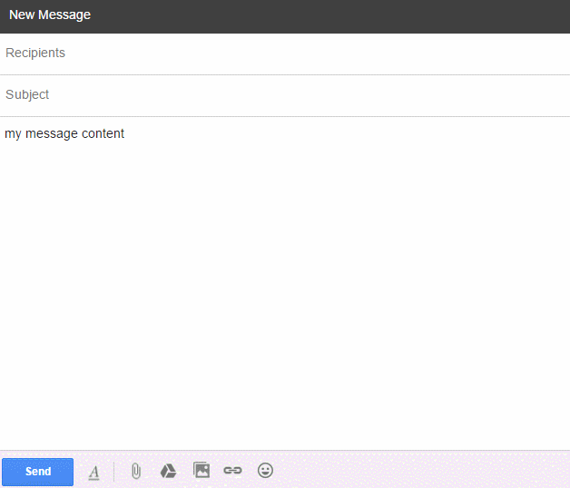

## Troubleshooting

### Toggle isn't working after install

Make sure you restarted Firefox or Thunderbird, and either restarted Chrome/Safari/Opera or reloaded your webmail page.

### No syntax highlighting

Switch your "Syntax Highlighting CSS" theme in the MDH Options.

### Getting the latest Primary Styling CSS

MDH doesn't automatically update your Primary Styling CSS if the default changes ([issue #48](https://github.com/adam-p/markdown-here/issues/48)), so you'll need to manually reset it.

### Signature getting rendered

See the [Tips and Tricks entry](Tips-and-Tricks#using-email-signatures).

## Reporting and Debugging

### Copying HTML

#### Chrome

#### Firefox

### Inspecting background scripts

#### Chrome

